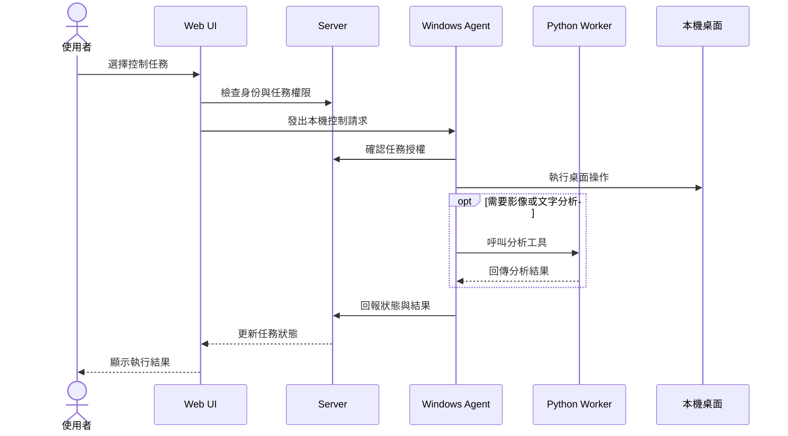

# 桌面控制任務流程

```mermaid
sequenceDiagram
    actor User as 使用者
    participant UI as Web UI
    participant Server
    participant Agent as Windows Agent
    participant Worker as Python Worker
    participant PC as 本機桌面

    User->>UI: 選擇控制任務
    UI->>Server: 檢查身份與任務權限
    UI->>Agent: 發出本機控制請求
    Agent->>Server: 確認任務授權
    Agent->>PC: 執行桌面操作
    opt 需要影像或文字分析
        Agent->>Worker: 呼叫分析工具
        Worker-->>Agent: 回傳分析結果
    end
    Agent->>Server: 回報狀態與結果
    Server-->>UI: 更新任務狀態
    UI-->>User: 顯示執行結果
```

任務啟停、工作階段與資源清理由 Agent 管理；授權和平台狀態由 Server 管理。
